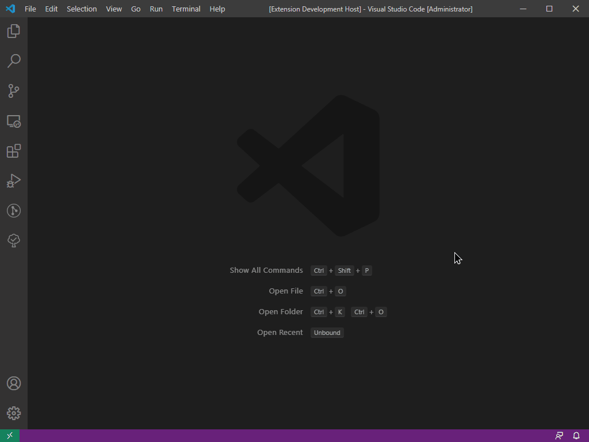
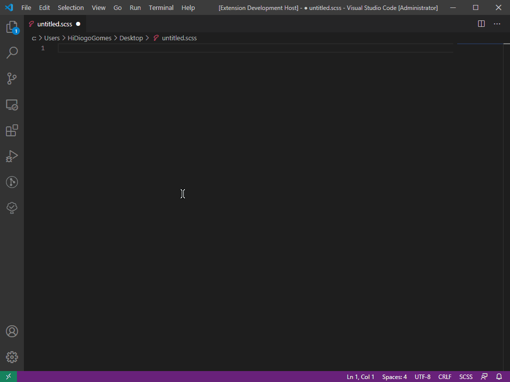
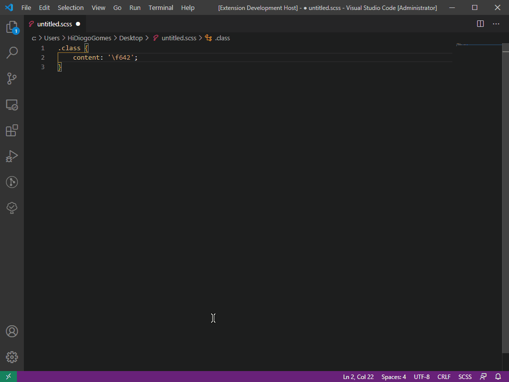

# Front End Snippets

Front end snippets offers a bunch of style snippets such as css var function, outsystems service studio prefix and font awesome icons.

## Installation

### Extension Marketplace

> coming soon...

### Clone Repository
Change to your Visual Studio Code extensions directory:
```
# Windows
$ cd %USERPROFILE%\.vscode\extensions

# Linux & macOS
$ cd ~/.vscode/extensions/
```

Clone repository and install extension:
```
$ git clone https://github.com/diogo-ml-gomes/front-end-snippets.git
```

## Features
 - Outsystems Service Studio Prefix
 - Unicodes from FontAwesome
 - CSS var function (perfect for people like me who doesn't like to write brackets :sweat_smile:)

## Commands 

### Plugin Version:

 - Press `Ctrl + Shift + P` to call the command pallete 
 - Type *"FESV"*, enough to get *"Front End Snippets: Version"* name in list



## Use:

### Font Awesome Unicodes
 - Type font awesome icon name and after you select one, the output will be the unicode for the icon. 



### Other Snippets
 - Type -ss- for outsystems service studio prefix or var to insert css variable function.

